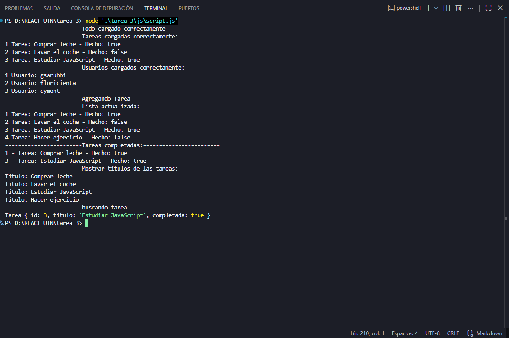

# Gestor de Tareas con JavaScript Avanzado

Proyecto correspondiente al **Módulo 1 - Unidad 3: JavaScript Avanzado**.

## Descripción

Este proyecto implementa un gestor de tareas utilizando JavaScript moderno.
El objetivo principal es practicar el uso de clases, métodos, promesas, asincronía con `async/await`, métodos de arrays y ejecución de operaciones en paralelo con `Promise.all`.

La aplicación simula la carga inicial de tareas y usuarios mediante funciones asíncronas que devuelven promesas. Luego, permite listar tareas, agregar una nueva tarea, buscar tareas por título, filtrar tareas completadas y mostrar los títulos utilizando `map`.

## Objetivos del proyecto

* Crear clases con propiedades y métodos.
* Utilizar una clase `Tarea` para representar tareas individuales.
* Crear una clase `GestorTareas` para administrar un listado de tareas.
* Usar métodos de arrays como:

  * `forEach`
  * `find`
  * `filter`
  * `map`
* Simular asincronía con `Promise` y `setTimeout`.
* Usar `async/await` para esperar la carga de datos.
* Aplicar `Promise.all` para cargar tareas y usuarios en paralelo.
* Mostrar los resultados por consola.

## Tecnologías utilizadas

* JavaScript
* Consola del navegador o Node.js

## Estructura sugerida del proyecto

```text
gestor-tareas-js/
├── js/
│   └── app.js
├── screenshots/
│   └── capturaConsola.png
└── README.md
```

## Funcionalidades implementadas

### Clase `Tarea`

La clase `Tarea` representa una tarea individual.

Propiedades:

* `id`: identificador único de la tarea.
* `titulo`: nombre o descripción de la tarea.
* `completada`: valor booleano que indica si la tarea está hecha o no.

Método:

* `toggleEstado()`: cambia el estado de la tarea. Si está completada, pasa a no completada. Si no está completada, pasa a completada.

### Clase `GestorTareas`

La clase `GestorTareas` administra un array de tareas.

Métodos:

* `agregarTarea(titulo)`: crea una nueva tarea y la agrega al array.
* `listarTareas()`: muestra todas las tareas en consola.
* `buscarPorTitulo(titulo)`: busca una tarea por su título utilizando `find`.
* `listarCompletadas()`: devuelve las tareas completadas utilizando `filter`.

### Clase `Usuario`

La clase `Usuario` representa un usuario cargado de forma simulada.

Propiedades:

* `id`: identificador del usuario.
* `nombre`: nombre del usuario.

### Clase `GestorUsuarios`

La clase `GestorUsuarios` administra un array de usuarios.

Método:

* `listarUsuarios()`: muestra todos los usuarios en consola.

## Simulación asíncrona

El proyecto incluye dos funciones asíncronas:

```js
cargarTareas()
```

Simula la carga inicial de tareas usando una promesa y `setTimeout`.

```js
cargarUsuarios()
```

Simula la carga de usuarios usando una promesa y `setTimeout`.

Ambas funciones se ejecutan en paralelo usando:

```js
Promise.all()
```

De esta manera, el programa espera a que se carguen las tareas y los usuarios antes de continuar con el flujo principal.

## Flujo del programa

El flujo principal se ejecuta dentro de la función:

```js
iniciarApp()
```

Esta función realiza las siguientes acciones:

1. Crea una instancia de `GestorTareas`.
2. Crea una instancia de `GestorUsuarios`.
3. Carga tareas y usuarios en paralelo con `Promise.all`.
4. Asigna las tareas al gestor de tareas.
5. Asigna los usuarios al gestor de usuarios.
6. Muestra un mensaje indicando que todo fue cargado correctamente.
7. Lista las tareas iniciales.
8. Lista los usuarios cargados.
9. Agrega una nueva tarea.
10. Muestra la lista actualizada.
11. Filtra y muestra las tareas completadas.
12. Usa `map` para mostrar solo los títulos de las tareas.
13. Busca una tarea por título.


## Ejemplo de salida en consola

```text
------------------------Todo cargado correctamente------------------------

------------------------Tareas cargadas correctamente:------------------------
1 Tarea: Comprar leche - Hecho: true
2 Tarea: Lavar el coche - Hecho: false
3 Tarea: Estudiar JavaScript - Hecho: true

------------------------Usuarios cargados correctamente:------------------------
1 Usuario: gsarubbi
2 Usuario: floricienta
3 Usuario: dymont

------------------------Agregando Tarea------------------------

------------------------Lista actualizada:------------------------
1 Tarea: Comprar leche - Hecho: true
2 Tarea: Lavar el coche - Hecho: false
3 Tarea: Estudiar JavaScript - Hecho: true
4 Tarea: Hacer ejercicio - Hecho: false

------------------------Tareas completadas:------------------------
1 - Tarea: Comprar leche - Hecho: true
3 - Tarea: Estudiar JavaScript - Hecho: true

------------------------Mostrar títulos de las tareas:------------------------
Título: Comprar leche
Título: Lavar el coche
Título: Estudiar JavaScript
Título: Hacer ejercicio

------------------------buscando tarea------------------------
Tarea {
  id: 3,
  titulo: 'Estudiar JavaScript',
  completada: true
}
```

## Capturas de pantalla

Ejemplo:


## Conceptos aplicados

### Clases

Se utilizan clases para organizar el código y representar entidades del programa, como tareas y usuarios.

### Promesas

Se utilizan promesas para simular la carga de datos de manera asíncrona.

### setTimeout

Se usa `setTimeout` para simular una demora de carga de datos de 2 segundos.

### async/await

Se utiliza `async/await` para escribir código asíncrono de forma más clara y ordenada.

### Promise.all

Se utiliza `Promise.all` para ejecutar varias promesas en paralelo y esperar a que todas finalicen.

### Métodos de arrays

Se aplican distintos métodos de arrays:

* `forEach`: para recorrer y mostrar tareas o usuarios.
* `find`: para buscar una tarea por título.
* `filter`: para obtener solo las tareas completadas.
* `map`: para crear un nuevo array con los títulos de las tareas.

## Autor

Gino Sarubbi
